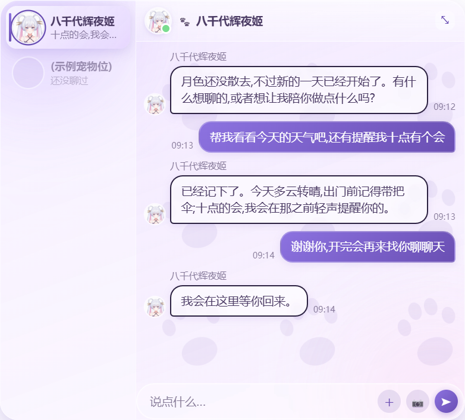
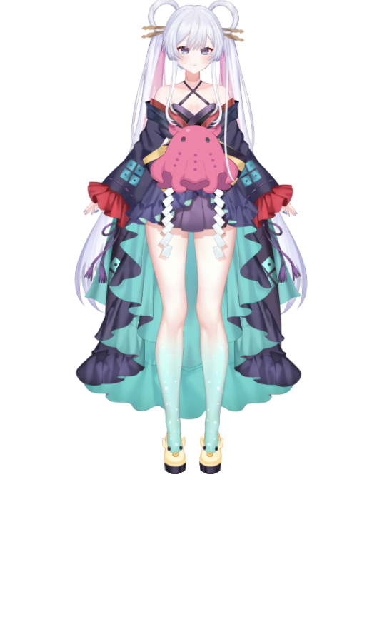

<div align="center">

# 🐾 Tamashii

**桌面宠物 · 自带 Agent 内核**

一只趴在桌面上的透明小可爱，背后跑着一个自研的 Agent 内核 —— 有性格、记得住你、会聊天办点小事，还能开口说话。

[](LICENSE)
[](#安装打包版)
[](https://www.electronjs.org/)
[](https://www.typescriptlang.org/)

[下载安装](#安装打包版) · [核心特性](#核心特性) · [开发](#开发) · [宠物包](#宠物包可移植可编辑可换) · [做自己的宠物](docs/making-a-pet.md)



<sub>演示图中的宠物角色形象与对话内容基于《超时空辉夜姬！》中的角色"月见八千代"二次创作，为非官方同人内容，仅作为本项目功能展示，与该角色原作品版权方无任何关联，不代表官方立场。若权利方对此有异议，请提交 issue 或联系仓库作者，会第一时间处理。</sub>

</div>

---

## 这是什么

Tamashii 是一个开源的桌面 AI 搭子：一只 Shimeji 风格的透明桌宠，始终置顶、可以拖着满屏跑，性格全靠一份纯文本 `persona.md` 调教。但它不是一个只会播动图的挂件 —— 背后是一个自研的 Agent 内核（受 OpenClaw 启发），接了真实的 LLM，记得住你、会主动搭话，还能顺手帮你办点小事：查资料、读网页、管待办提醒、整理它自己的工作目录，你明确开启后甚至能替你点几下鼠标、敲几行字。皮肤既可以是传统逐帧精灵图，也可以换成 Live2D Cubism 模型（会跟着鼠标转头、说话对口型）。整个项目开源，宠物的人设 / 台词 / 技能都是纯文本，欢迎照着 [docs/making-a-pet.md](docs/making-a-pet.md) 做一只自己的。

## 核心特性

- 👋 **有反应会互动** —— 闲置念叨、戳一下有反应、拖起来会叫、早晚问候、久坐提醒，不是干站着的贴图
- 🎭 **人设可编辑** —— `persona.md` 直接改，重启即生效，想要什么性格自己调
- 🎨 **换皮无痛 · 精灵图 / Live2D 双渲染** —— 一只宠物 = 一个自包含文件夹，拷走即备份、改配置即换宠物；渲染既可以是传统逐帧精灵图，也可以是 Live2D Cubism 模型（鼠标追踪转头、说话对口型），宠物间热切换不闪烁（模型文件需自行准备并遵守 Live2D 授权，不随本仓库分发）
- 🗨️ **能聊会用工具** —— 接入 Claude / 任意 OpenAI 兼容端点，联网搜索、查天气、深度读网页（Firecrawl）、剪贴板文字加工，工具调用循环自动多轮回灌
- 📝 **记得住待办和提醒** —— 说一句"提醒我 20 分钟后……"它就记着，到点主动提醒，不用你另开日历 App
- 📁 **能帮你整理文件** —— 每只宠物有个自己的专属工作目录，能读、写、新建、编辑、删除里面的文件（不是全盘乱翻），设置页一键打开这个目录看它到底动了什么
- 🖱️ **能替你动手** —— 截屏、点击、打字、操作浏览器网页（默认关闭，开启前强确认 + 执行时悬浮提示 + 你一抓鼠标立刻中断）
- 🖼️ **看得懂图片** —— 选图 / 拖拽 / 粘贴 / 框选截屏，丢给支持视觉的模型识图，图片不落盘
- 🎙️ **会开口说话** —— 内置 TTS 语音合成，逐句流式播放不卡顿，点击宠物可打断
- 🧠 **分层记忆** —— 事实库（人类可读、可编辑）+ 可选向量召回 + 对话摘要，长期记得你是谁、说过什么

## 安装（打包版）

前往 [Releases](https://github.com/NIYAOYE/Tamashii/releases) 下载最新的 `Tamashii Setup <版本>.exe`，双击走安装向导。**不需要装 Node、不需要命令行**。

默认**每用户安装、免管理员**（装到 `%LOCALAPPDATA%\Programs\Tamashii`，可在向导里改目录），并创建桌面 / 开始菜单快捷方式。

> ⚠️ **未签名提示**：安装包未做代码签名，首次运行 Windows SmartScreen 可能拦截 →「更多信息」→「仍要运行」。

安装包本身**不自带宠物**：首次启动会弹出设置窗，提示你导入一个宠物包。Releases 页同时提供了一个示例宠物包 `luluka-pet-pack.zip`，下载解压后在设置窗里「导入宠物包」选中该文件夹即可；之后再选择 Provider（Claude / OpenAI 兼容端点）、填入 API Key 就能开始对话。

## 开发

包管理器是 **pnpm**（不是 npm/yarn）。

```bash
pnpm install
pnpm dev                         # 开发模式（HMR）
pnpm build                       # 类型检查 + 构建三个 bundle
pnpm preview                     # 跑打包后的产物（比 dev 更接近真实环境）
pnpm test                        # 单元测试（Vitest）
pnpm dist                        # 打包 Windows 安装包 → dist/Tamashii Setup <版本>.exe
```

### Live2D Cubism Core 运行时

`vendor/live2d-core/` 和 `src/renderer/public/live2dcubismcore.js` 未随仓库分发(Live2D 官方 SDK 许可证不允许随意再分发,已被 gitignore)。首次开发 live2d 渲染相关功能前,运行一次：

```bash
pnpm live2d:setup
```

该命令会从 Live2D 官网下载 Cubism SDK for Web 并解压出运行时脚本。

<details>
<summary>打包构建说明（Windows 坑）</summary>

`pnpm dist` 用 electron-builder 出 NSIS 安装包。它会下载 `winCodeSign` 工具包，该包内含 macOS 的 `.dylib` **符号链接**，Windows 下解压创建符号链接需要权限，普通终端会报
`Cannot create symbolic link ... 客户端没有所需的特权` 并失败（即使不做签名）。三选一解决：

1. **开启 Windows 开发者模式**（设置 → 隐私和安全性 → 开发者选项 → 开发人员模式），之后普通终端即可创建符号链接；或
2. 用**管理员终端**跑 `pnpm dist`；或
3. **预解压缓存**（跳过 darwin 符号链接）——一次性，之后 `pnpm dist` 正常：
   ```bash
   SEVENZ="node_modules/7zip-bin/win/x64/7za.exe"
   CACHE="$LOCALAPPDATA/electron-builder/Cache/winCodeSign"
   "$SEVENZ" x "$CACHE"/*.7z -o"$CACHE/winCodeSign-2.6.0" -xr'!'darwin -y
   ```

**`TypeError: Yallist is not a constructor`**（`node_modules/hosted-git-info/node_modules/lru-cache/index.js` 内报出，`electron-builder` 26.x 起出现）：本项目 `.npmrc` 用 `node-linker=hoisted`，把所有依赖拍平到顶层 `node_modules`。`electron-builder@26.x` 新引入的 `@electron/rebuild → node-gyp → tar@7.x` 链需要 `yallist@5.x`（ESM 重写版，无旧版 CommonJS 构造函数导出），会顶掉 `hosted-git-info` 的嵌套 `lru-cache@6.x` 原本需要的 `yallist@^4.0.0`（该嵌套包自身没有私有拷贝，落到顶层不兼容的 5.x 版本上报错）。此现象仅在 `node_modules` 由多次增量 `pnpm install` 累积而来时出现，全新 `pnpm install` 不会触发。**解决**：删除 `node_modules` 后重新安装，让 pnpm 一次性重算依赖拍平结果：
```bash
rm -rf node_modules && pnpm install
```

</details>

## 宠物包：可移植、可编辑、可换

<div align="center">


<sub>Live2D 渲染模式实拍：宠物以 Live2D Cubism 模型的形式出现在透明置顶窗口里，会跟着鼠标转头、说话对口型，和上方对话框演示图是同一只宠物（角色形象与出处见上方免责声明）。这是真机截图，不是效果图。</sub>
</div>

一只宠物 = 一个**自包含文件夹**，首次启动后落在用户目录 `%APPDATA%\Tamashii\pets\<宠物id>\`，内含：

| 文件 | 作用 |
|---|---|
| `pet.json` | 元数据 + 渲染配置（`render.type` 决定走精灵图还是 Live2D；改 `displayName` 即改宠物显示名） |
| `spritesheet.webp` | 精灵图包的美术素材（Live2D 包换成模型文件夹） |
| `persona.md` | **人设**，可直接编辑调教宠物，重启生效 |
| `lines.json` | 台词库 |
| `voice/` | 语音音色配置 |
| `memory/` | **这只宠物的长期记忆**（见下） |

宠物包有两种渲染类型：**精灵图**（逐帧动图，`spritesheet.webp`）和 **Live2D**（Cubism 模型，需自备已获授权的模型文件，运行时依赖需单独 `pnpm live2d:setup` 获取，见下方「开发」一节）。设置窗内可直接**选择 / 导入**新的宠物包，两种类型混用不冲突。整个 `pets\<id>\` 文件夹可直接拷走（U 盘 / 网盘）备份，或迁移到另一台机器 —— 性格 + 记忆一起走。

想自己做一只？完整流程（精灵图美术生成 / Live2D 模型接入 / 人设 / 台词 / GPT-SoVITS 语音克隆）见 [docs/making-a-pet.md](docs/making-a-pet.md)。

## 记忆与隐私

宠物拥有分层记忆，数据存在**该宠物文件夹**的 `memory/` 里（设置窗有「打开记忆文件夹」按钮）：

- `facts.json` —— 宠物记住的关于你的事实，唯一权威源，人类可读，可手动编辑/删除
- `vector-index.json` —— 由事实生成的向量索引，可随时删除会自动重建
- `summary.json` / `transcript.json` —— 对话摘要与最近对话历史

**Embedding**：如果在设置里配置了 embedding 端点，被记住的事实文本会发去做向量化用于按话题召回；**留空即完全本地**，功能照常可用。

**识图/截屏**：图片仅本次发送使用，**不写入本地记忆**；截屏 / 桌面控制类工具默认关闭，开启前需要你手动确认。

**API Key**：经 Windows 凭据存储（safeStorage / DPAPI）加密，与本机本用户绑定、不可移植，换机器需重新填。

卸载应用**不会删除** `%APPDATA%\Tamashii` 下的记忆与配置。

## 技术栈

Electron · TypeScript（strict）· electron-vite · Vitest · electron-builder，主进程/渲染进程通过 `contextBridge` 暴露的最小 IPC 通信，`contextIsolation` + `sandbox` + 无 `nodeIntegration` 的安全基线。Live2D 渲染模式另加 PixiJS + Live2D Cubism SDK for Web（运行时不随仓库分发，见上文）。

更多设计细节见 [PROGRESS.md](PROGRESS.md)。

## License

[MIT](LICENSE)
